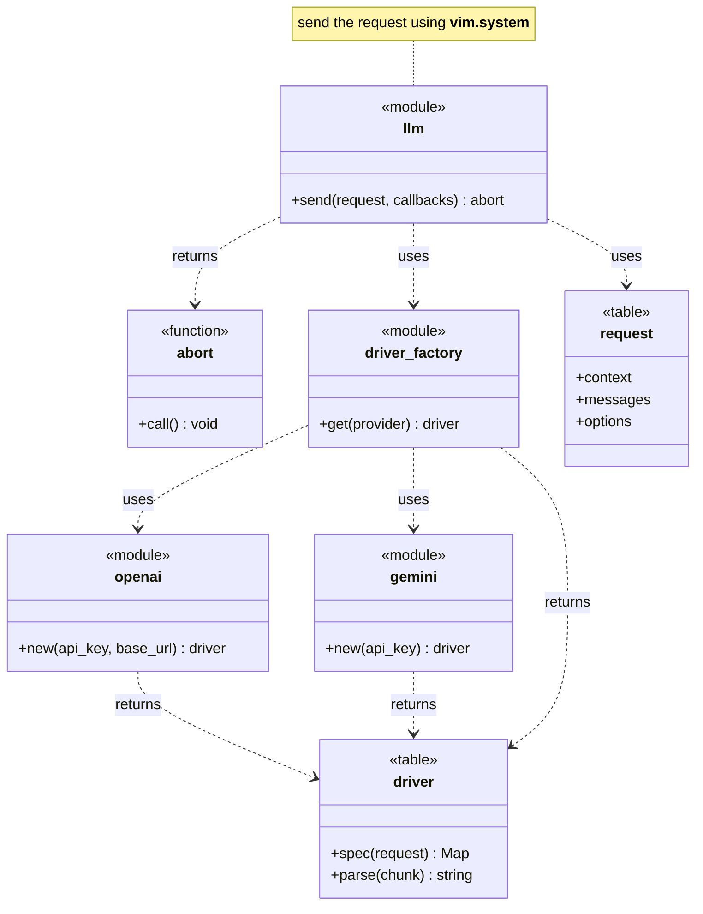

# Separate LLM chat-completion Engine
## LLM Engine
MarkdownLLm has a separate LLM engine for chat-completion requests. The engine can be used by different entrypoints.

## Design Summary
The llm module exposes a single function **send** that orchestrates the chat-completion request and delegates to provider-specific functions.
The function **send** accepts a request object and a table of callbacks.

## Template Pattern llm.lua
The engine orchestrates a flow; drivers implement details via a small contract.
The engine owns stream buffering and feeds `driver.parse` complete events (SSE or JSONL), so providers stay stateless and focus on parsing a single event.

## Callbacks Contract
- `on_error(err)`: fatal; the engine aborts the request and stops streaming.
- `on_warning(warn)`: non-fatal; used for recoverable parse issues while streaming continues.
- `on_chunk(text)`: streaming text fragments; called zero or more times.
- `on_complete()`: called once on successful completion.

## Request 
llm.lua defines a clear interface for the request. The request is provider agnostic.

#### 1. Context (`request.context`)
*Meta-information used by the engine for routing, driver selection, and request lifecycle management.*

| Property | Type | Description |
| :--- | :--- | :--- |
| **`provider`** | `string` | The identifier for the service to use (e.g., `"openai"`, `"deepseek"`, `"gemini"`).| 
| **`model`** | `string` | The specific model ID to target (e.g., `"gpt-4-turbo"`, `"claude-3-opus-20240229"`). |
| **`stream`** | `boolean` | If `true`, the engine expects SSE and calls `callbacks.on_chunk` incrementally. |
| **`timeout`** | `integer` | *(Optional)* The timeout in milliseconds for the request connection/read. |

#### 2. Messages (`request.messages`)
*The core payload representing the conversation history. This follows the standard chat-completion format.*

Array of message objects, where each object contains:

| Property | Type | Description |
| :--- | :--- | :--- |
| **`role`** | `string` | The entity sending the message. Common values: `"system"`, `"user"`, `"assistant"`. |
| **`content`** | `string` | The text content of the message. |


#### 3. Options (`request.options`)
*Standardized hyperparameters supported by the majority of LLM providers. The Driver is responsible for mapping these standard keys to the specific API field names (e.g., mapping `max_tokens` to `max_completion_tokens`).*

| Property | Type | Description |
| :--- | :--- | :--- |
| **`temperature`** | `float` | Controls randomness (0.0 to 2.0). Lower values make output more deterministic; higher values make it more creative. |
| **`max_tokens`** | `integer` | The maximum number of tokens to generate in the response. |
| **`top_p`** | `float` | Nucleus sampling probability (0.0 to 1.0). An alternative to sampling with temperature. |
| **`stop`** | `table` | A list of strings (sequences) where the API will stop generating further tokens. |
| **`frequency_penalty`** | `float` | Penalizes new tokens based on their existing frequency in the text so far (typically -2.0 to 2.0). |
| **`presence_penalty`** | `float` | Penalizes new tokens based on whether they appear in the text so far (typically -2.0 to 2.0). |
| **`seed`** | `integer` | If specified, the system will make a best effort to sample deterministically. |
| **`tools`** | `table` | A list of tool definitions (function calling schemas) available to the model. |


### Example Non-Streaming Request 

```lua
local response = {}
local req = {
  context = {
    provider = "openai",
    model = "gpt-4o",
    stream = false,
    api_key_name = "OPENAI_API_KEY",
  },
  messages = {
    { role = "system", content = "You are a concise coding assistant." },
    { role = "user", content = "Summarize the Single Responsibility Principle." }
  },
  options = {
    temperature = 0.3,
    max_tokens = 400,
  }
}

require("markdownllm.llm").send(req, {
  on_chunk = function(text)
    table.insert(response, text)
  end,
  on_complete = function()
    local output = table.concat(response, "")
    print(output)
  end,
  on_error = function(err)
    vim.notify(err, vim.log.levels.ERROR)
  end,
})
```

## Class Diagram

